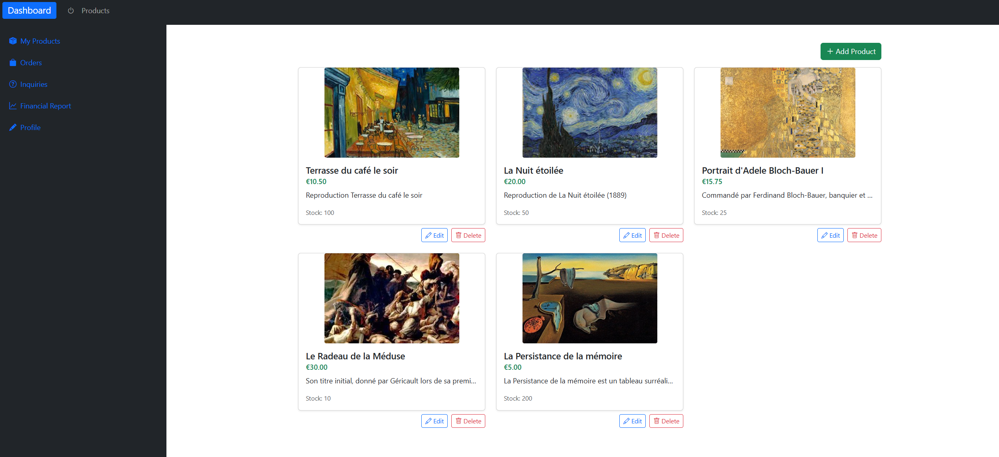
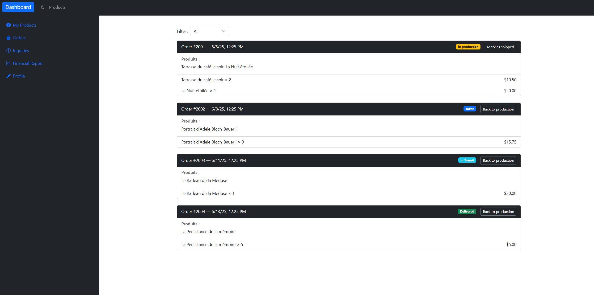
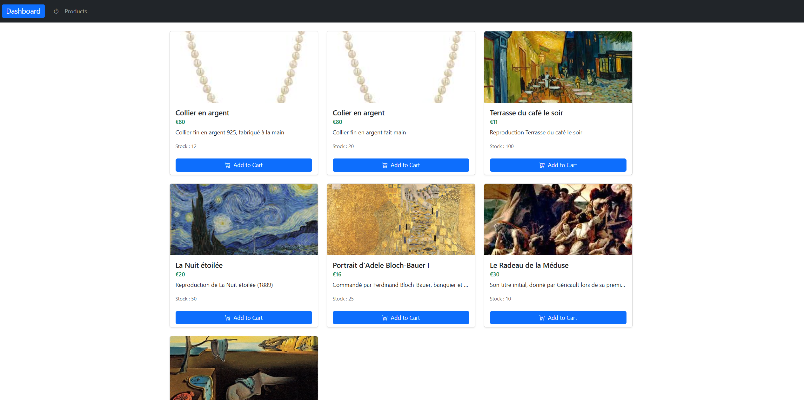
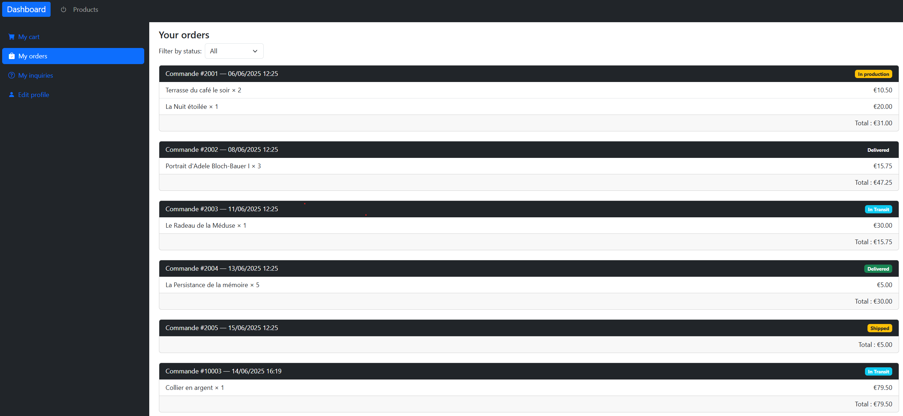

# 🎨 Server-Client Art App

Full-stack web application for managing an online art marketplace, built with an Angular frontend and an ASP.NET Core backend.

The application includes role-based features for several user profiles: customers, artisans, delivery partners and administrators. It allows artisans to manage their products and orders, delivery partners to follow assigned orders, and administrators to manage users, products and reviews.

### Key technical points:

+ Angular single-page application with routing, guards and role-based dashboards  
+ ASP.NET Core Web API backend  
+ JWT authentication and authorization by user role  
+ Layered backend architecture: Domain, DAL, Business Logic and API Controllers  
+ Repository and service pattern  
+ Entity Framework Core with SQL Server  
+ Product, order, cart, review, inquiry and delivery management  
+ Swagger/OpenAPI documentation for API testing  

### Technologies:  
Angular, TypeScript, C#, ASP.NET Core, .NET 8, Entity Framework Core, SQL Server, JWT, Swagger, Bootstrap

# 📌 Project overview

Server-Client Art App is a full-stack web application designed to manage an online art marketplace.

The project is built with an Angular frontend and an ASP.NET Core Web API backend. It includes several user roles, each with specific features and access rights: Customer, Artisan, Delivery Partner and Admin.

This project demonstrates the development of a complete client-server application, including authentication, role-based access control, database modeling, API design and a structured backend architecture.

# ✨ Main features
+ Artisan
+ Manage own products
+ Create, edit and delete products
+ View orders related to their products
+ Update order status
+ Manage profile information
+ View customer inquiries
+ Access revenue/reporting features
+ Customer
+ Browse available products
+ View product details
+ Manage cart and orders
+ Submit reviews and inquiries
+ Delivery Partner
+ View assigned orders
+ Update delivery/order status
+ Administrator
+ Manage user accounts
+ Manage artisan products
+ Delete customer reviews
+ Access protected administration features
# 🏗️ Backend architecture

The backend follows a layered architecture:

backendArt/  
├── Domain        # Domain entities  
├── DAL           # Data access layer and repositories  
├── BL            # Business logic, services, DTOs and mapping  
└── backendArt    # ASP.NET Core Web API controllers and configuration  

The backend uses:

+ Controllers to expose REST API endpoints
+ Services to handle business logic
+ Repositories to access data
+ DTOs and AutoMapper for data transfer
+ Entity Framework Core for database access
+ JWT Bearer authentication for secured endpoints
+ Swagger/OpenAPI for API documentation and testing

# 🧱 Database model

The application manages several domain entities, including:

+ Users  
+ Artisans  
+ Customers  
+ Delivery Partners  
+ Administrators  
+ Products  
+ Cart items  
+ Orders  
+ Order items  
+ Reviews  
+ Delivery status updates  
+ Customer inquiries
  
# 🖥️ Frontend architecture

The frontend is an Angular single-page application with:

+ Routing
+ Authentication pages
+ Protected routes
+ Role-based guards
+ Separate dashboards for Admin, Artisan, Customer and Delivery Partner
+ Product listing and product detail pages
+ Bootstrap-based UI components
  
# 🔐 Authentication and authorization

The application uses JWT authentication.
Access to specific pages and API endpoints is restricted depending on the authenticated user role.
 
# 🛠️ Technologies used
Frontend
Angular 17
TypeScript
Angular Router
Bootstrap
Bootstrap Icons
RxJS
JWT Decode
Backend
C#
ASP.NET Core Web API
.NET 8
Entity Framework Core
SQL Server
AutoMapper
JWT Bearer Authentication
Swagger / OpenAPI  

# 🖼️ Application views

Below are some screenshots of the main interfaces of the application.

### 🧑‍🎨 Artisan's Dashboard

The artisan dashboard gives sellers a central overview of their activity.
From this page, artisans can access their products, manage their orders and follow the evolution of their sales.

### 📦 Artisan's Orders

This view allows artisans to follow the orders related to their products.
They can consult order details and update the order status depending on the progress of the sale.

### 🛍️ Marketplace Dashboard

The marketplace dashboard displays the products available in the application.
Customers can browse the catalog, view product information and access the purchasing process.

### 👤 Customer's Orders

This view allows customers to follow their personal orders.
They can check the status of their purchases and consult the details of previous or ongoing orders.

        

> [!NOTE]
> DB Acccess for tests.
> 
>Admin id for testing : admin: admin123 pw: 123
>                   

                       
